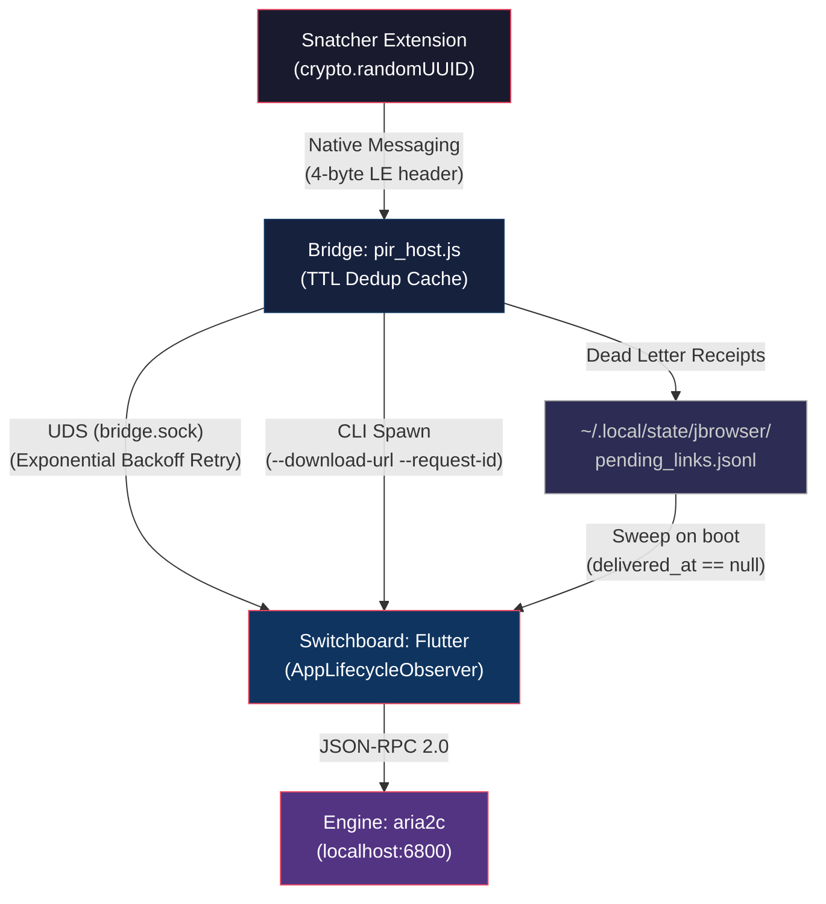

# JBrowser Vault: End-to-End Data Pipeline Architecture (Restored)

## Executive Summary

The JBrowser Vault uses a high-performance, resilient data pipeline. The architecture enforces **cryptographic idempotency** at every layer: *One Click → One UUID → One Bridge Entry → One UI Tile → One Engine Task*.

---

## 1. High-Level Flow (IPC Topology)

---

## 2. SOTA Features (FAANG-Ready Architecture)

### 2.1 Cryptographic Idempotency
- **Extension Level**: `crypto.randomUUID()` generates a unique `requestId` for every interception.
- **Bridge Level**: 5-second TTL cache (`seenRequests`) drops duplicate signals instantly.
- **Flutter Level**: Sink-level guard in `addPending()` prevents duplicate UI tiles.

### 2.2 IPC: UDS Protocol
- **Security**: Unix Domain Sockets (0700 permissions) provide isolated communication.
- **Performance**: Bypass TCP stack overhead via kernel-bridged pipes.
- **Reliability**: `BytesBuilder` in Flutter ensures correct JSON decoding of chunked packets.

### 2.3 Resiliency: Connect-or-Ignite
1. **Journaling**: Persistent logging to `pending_links.jsonl` *before* IPC attempts.
2. **UDS Handoff**: Primary delivery path for lightning-fast updates.
3. **CLI Spawn**: Binary fallback if the app isn't running, passing `--download-url`.

---

## 3. The "Bulletproof" Polish (Final Phase)

### 3.1 Exponential Backoff Retry
The bridge replaces flat sleeps with a recursive `waitForUds` loop (200ms start, 1.5x multiplier, 800ms cap, 4s deadline). This guarantees delivery the exact millisecond the app is ready.

### 3.2 Dead Letter Receipts
The journal now tracks `delivered_at` timestamps. 
- **Bridge**: Marks successful handoffs (UDS or RPC) with a receipt.
- **Flutter**: Startup sweep ignores entries with timestamps to prevent cross-session "echoes".

### 3.3 Environment Sterilization
Full scrub of **9+ poisonous keys** (`LD_LIBRARY_PATH`, `GTK_PATH`, `PYTHONPATH`, etc.) and sanitization of `XDG_DATA_DIRS` to prevent AppImage library poisoning and crashes.

### 3.4 Narrow-Scope Manifests
Native Messaging manifests are restricted exclusively to Thorium's config and the ephemeral profile. No system-wide leakage to Chrome/Brave.

---

## 4. Lifecycle & Signal Chain

1. **User Click** -> Extension Intercept.
2. **Bridge Journaling** -> Link persisted on disk.
3. **Bridge Connection** -> UDS Backoff Poll until success.
4. **App Initialization** -> `AppLifecycleObserver` starts UDS and processes CLI/Journal.
5. **Receipt Update** -> Bridge marks link as "Delivered".

[SIGNAL: ARCH_DATA_CHAIN_V3_RESTORED] ⚓🏴‍☠️🏁
